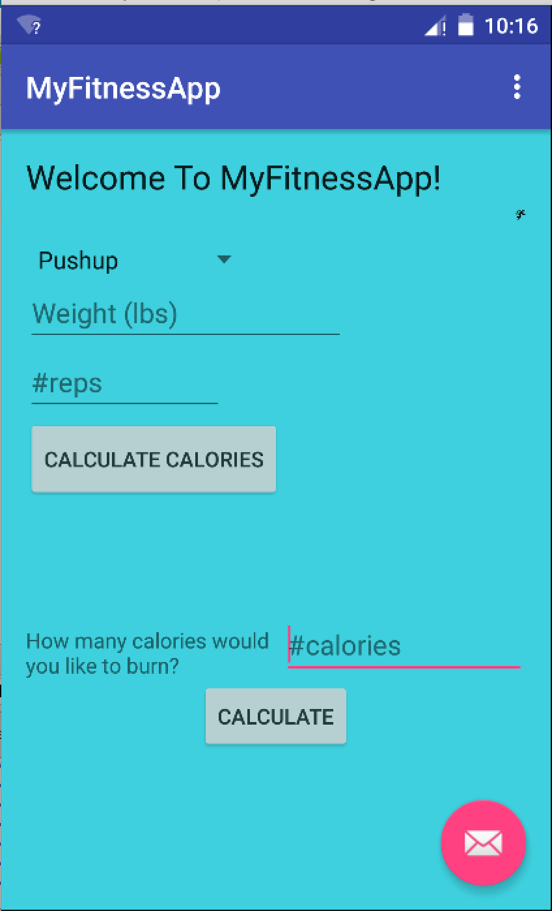
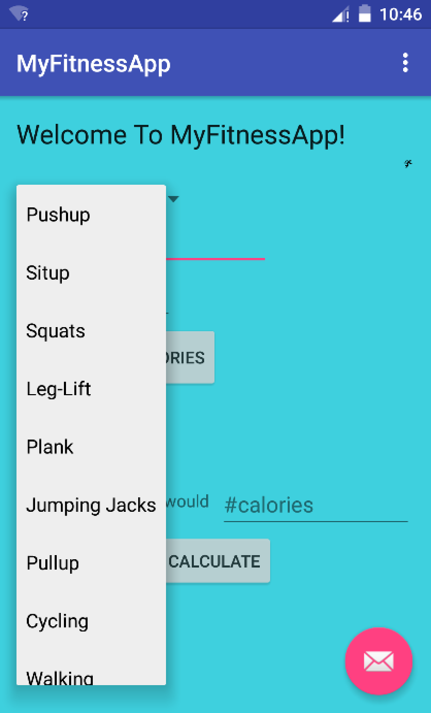
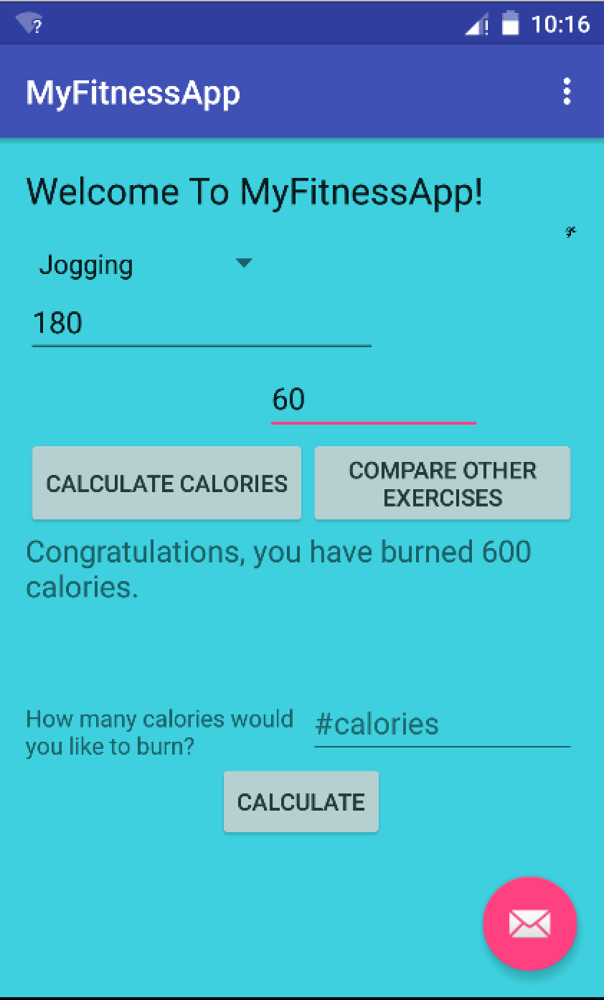
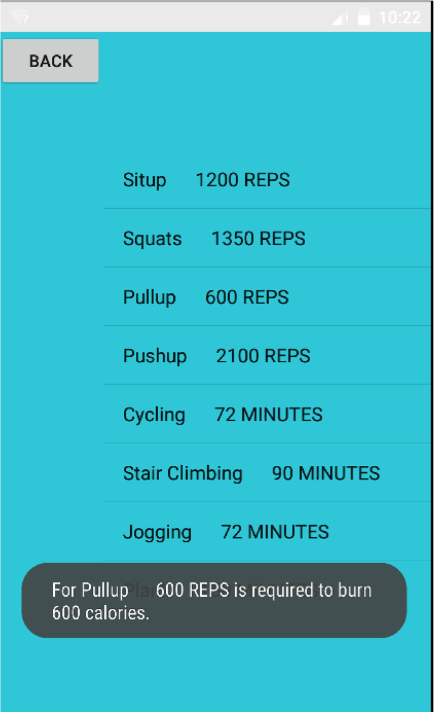

# PROG 01: Crunch Time

This app is a fitness app that helps users in two ways. First, before a workout, users can enter how many calories they want to burn and their weight  and then see, how many minutes/reps of a specific workout they need to do in order to reach their target. Second, after a workout, users can select what they did, type in their weight, and see how many calories they actually burned. This app is unique because users can also compare with other workouts. They can see how many reps/minutes of other workouts they would have to do in order to burn the amount of calories they just did. This app will help users choose the best workout for their goals, and use their time efficiently. 

## Authors

Sampath Duddu ([duddus@berkeley.edu](mailto:your_email@berkeley.edu))

## Demo Video

See [your demo video title here] (https://link_to_your_video)

## Screenshots

## Acknowledgments

Thank you, Stack Overflow.

*Feel free to enhance your README. For Markdown syntax, see [the GitHub Guides](https://guides.github.com/features/mastering-markdown/). Remove this line in your submission.*
